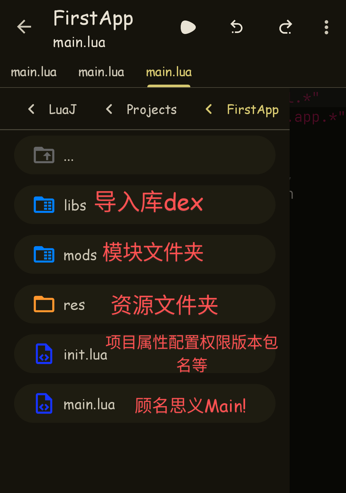
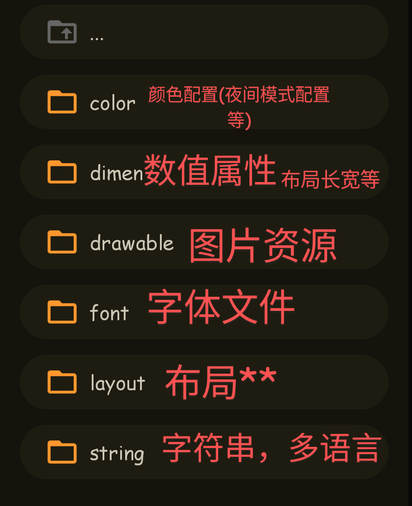
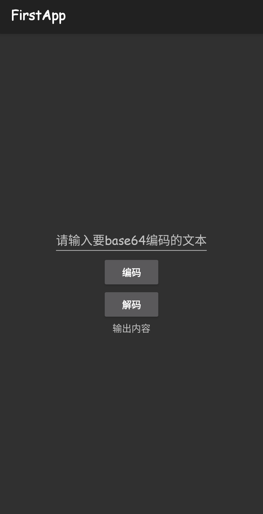
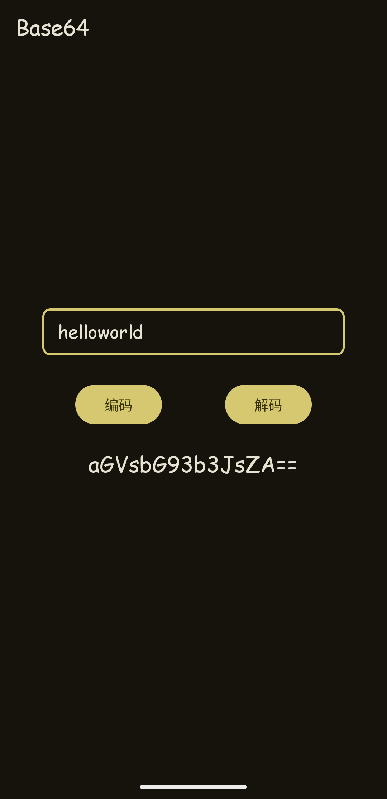

## 前言

也是androlua入门教程?

这里用到一个框架https://github.com/nirenr/AndroLua_pro

作者是：泥人（nirenr谐音，圈子里的叫法）

当然这个项目已经非常久没有更新了

所有需要用到一些社区的编辑器，比如

- OpenLuaX+(https://github.com/znzsofficial/OpenLuaX_Open-Source，已停更),
- **NeLuaJ+**(https://github.com/znzsofficial/NeLuaJ),
- AndLua+(如开源，一般用来写外挂绘制，已停更),
- Fusionapp2(一个木寒开发者开发，用于网页打包app，不开源，已停更)，
- **Aide Lua**(https://github.com/AideLua/AideLua)

这里推荐用**NeLuaJ+**,拥有比较新的依赖库(支持Material Design 3)

简单介绍一下开发流程

1. 起名，包括包名，应用名称
2. 写布局
3. 写业务逻辑
4. 调试(具体来说应该边写边调)
5. 打包

## 第一个app

### 0.下载相关软件
[NeLuaJ+](https://bluestars.lanzouu.com/i4Nmk2liuikf)


[打包器](https://bluestars.lanzouu.com/isoN82liuiaf)


* 推荐一下代码手册，可以发布代码，实时运行，（别忘了关注一下我awa

[代码手册](https://bluestars.lanzouu.com/iFZhN2liukvi)


### 1.创建项目

这里拿NeLuaj+来写

首先点积右上角…→项目→创建项目

输入软件名称和包名，模块目前不用选。

来到项目目录，点左上角三个横，详情如图↓



以及res目录详情,


我们先回到main.lua

看到它的代码

```lua
import "java.lang.*","java.util.*" --导入库
import "android.os.*","android.app.*" 
activity {  --当前界面
  Title = res.string.app_title,  --标题
  ContentView = res.layout.main  --布局
}
```

显然不是标准的lua语法，这是因为androlua有自己的语法糖，适应一下就好。

我们来写一个base64编码app

### 2.布局

首先需要写一个布局，输入框，按钮，输出的文字等

来到res/layout/main.lua，可以看到return后的一个表(lua中万能的类型)，俗称布局表，

```lua
return {  
  LinearLayout,  --线性布局
  orientation="vertical",  --竖向排列
  layout_width="match",  --宽度最大
  layout_height="match",  --高度最大
  gravity="center",  --子空间居中
  {
    AppCompatTextView, --文本控件
    text="Hello NeLuaJ+", --文字
   },
 }
```

是不是非常好理解，其实和xml布局非常类似，但是lua中写法精简，可以提升效率。

这了我们要写一个输入框，2个按钮(编码和解码)，一个输出文字框。

这了简单写了一下。

```lua
return {
  LinearLayout,
  orientation="vertical",
  layout_width="match",
  layout_height="match",
  gravity="center",
  {
    EditText,--编辑框
    hint="请输入要base64编码的文本",--提示文字
    id="编辑框",--这了的id是唯一的，在后续可以通过id访问控件
  },
  {Button,--按钮
    text="编码",
    id="编码",--为了方便理解，用了中文，虽然androlua支持中文函数，但是还是建议自己开发时用英文命名
  },
  {Button,
    text="解码",
    id="解码",
  },
  {TextView,--文本
    text="输出内容",
    id="输出文本",
    textIsSelectable=true,--这了让我们的文字可以被选中复制
  },
}
```

然后点击右上角三角，运行项目，即可看到效果。




ok!布局搞定啦

### 3.业务逻辑

回到我们/main.lua，在最下面开始写处理编码的功能

```lua
function Base64编码(data)
  local Base64=luajava.bindClass("android.util.Base64")
  return Base64.encodeToString(String(data).getBytes(),Base64.NO_WRAP);
end

function Base64解码(data)
  local Base64=luajava.bindClass("android.util.Base64")
  return String(Base64.decode(data,Base64.DEFAULT)).toString()
end

编码.onClick=function()--调用编码按钮的点击事件，
  输出文本.setText(Base64编码(输入框.text))
  --这了应该比较好理解，.text就是获取文本,setText就是设置文本
  --语法糖也可以这样写↓
  --输出文本.text=Base64编码(输入框.text)
end

--[[当然点击函数也可以这样写↓
function 编码.onClick()

end
]]

解码.onClick=function(_)--这了函数会接收到他自己的类，这里用不到
  输出文本.text=Base64解码(输入框.text)
end
```

这样你的app也就基本完成了✅

### 美化

这部分其实可有可无，但是如果你喜欢设计漂亮的app界面也可以看一下，可能涉及很多控件等，不会一一解释。

1.主题

首先来到init.lua，看到`NeLuaJ_Theme` 把值改成"`Theme_NeLuaJ_Material3`",一个md3主题

2.顶栏

在main.lua加

```lua
activity.getSupportActionBar().hide()
--隐藏默认顶栏
```

3.适配全屏

```lua
if Build.VERSION.SDK_INT >= 21 then
  window = activity.getWindow()
  window.clearFlags(WindowManager.LayoutParams.FLAG_TRANSLUCENT_STATUS);
  window.addFlags(WindowManager.LayoutParams.FLAG_DRAWS_SYSTEM_BAR_BACKGROUNDS);
  window.setStatusBarColor(Color.TRANSPARENT);
  window.addFlags(WindowManager.LayoutParams.FLAG_LAYOUT_NO_LIMITS);
  window.addFlags(WindowManager.LayoutParams.FLAG_TRANSLUCENT_NAVIGATION)
 else
  window.addFlags(WindowManager.LayoutParams.FLAG_TRANSLUCENT_STATUS);
  window.addFlags(WindowManager.LayoutParams.FLAG_TRANSLUCENT_NAVIGATION);
end
```

4.爆改布局

如下/res/layout/main.lua

```lua
import "android.widget.*", "androidx.appcompat.widget.*";
import "android.widget.EditText"
import "androidx.core.widget.NestedScrollView"
import "android.widget.LinearLayout"
import "android.widget.Button"
import "android.widget.TextView"
import "com.google.android.material.appbar.AppBarLayout"
import "androidx.coordinatorlayout.widget.CoordinatorLayout"
import "com.google.android.material.appbar.MaterialToolbar"
import "android.os.Build"
import "android.view.WindowManager"
import "android.graphics.Color"
import "com.google.android.material.button.MaterialButton"
import "com.google.android.material.textview.MaterialTextView"
import "android.view.View"
import "com.google.android.material.card.MaterialCardView"
R=import "com.google.android.material.R"
if Build.VERSION.SDK_INT >= 21 then
  window = activity.getWindow()
  window.clearFlags(WindowManager.LayoutParams.FLAG_TRANSLUCENT_STATUS);
  window.addFlags(WindowManager.LayoutParams.FLAG_DRAWS_SYSTEM_BAR_BACKGROUNDS);
  window.setStatusBarColor(Color.TRANSPARENT);
  window.addFlags(WindowManager.LayoutParams.FLAG_LAYOUT_NO_LIMITS);
  window.addFlags(WindowManager.LayoutParams.FLAG_TRANSLUCENT_NAVIGATION)
 else
  window.addFlags(WindowManager.LayoutParams.FLAG_TRANSLUCENT_STATUS);
  window.addFlags(WindowManager.LayoutParams.FLAG_TRANSLUCENT_NAVIGATION);
end

function 状态栏高度()
  if Build.VERSION.SDK_INT >= 19 then
    resourceId = activity.getResources().getIdentifier("status_bar_height", "dimen", "android")
    return activity.getResources().getDimensionPixelSize(resourceId)
   else
    return 0
  end
end

return {CoordinatorLayout;
  layout_width=-1;
  layout_height=-1;
  {
    AppBarLayout,
    layout_width="fill",
    layout_height="130dp",
    liftOnScroll="false",
    {
      MaterialToolbar,
      layout_scrollFlags="noScroll",
      title="Base64",
      layout_marginTop=状态栏高度(),
      id="toolbar",
      layout_width="fill",
      layout_height="56dp",
    },
  },

  {
    LinearLayout,
    orientation="vertical",
    layout_width="fill",
    layout_height="match",
    gravity="center",
    layout_marginTop="-120dp",
    layout_behavior="@string/appbar_scrolling_view_behavior",
    {MaterialCardView,
      id="edit卡片",
      layout_height="wrap",
      layout_width="wrap";
      layout_marginTop="20dp",
      layout_gravity='center',
      cardBackgroundColor=0,--卡片背景色
      cardElevation="0dp",--卡片阴影强度
      radius="8dp",--卡片圆角幅度
      strokeColor=0xff999999,
      strokeWidth="1dp",
      {
        EditText,
        layout_marginLeft="16dp",
        layout_marginRight="16dp",
        hint="请输入文本",
        id="输入框",
        layout_width="70%w",
        backgroundColor=0,
      },
    },
    {LinearLayout,
      layout_marginTop="18dp",
      Orientation=0,
      w="fill",
      h="wrap",
      {MaterialButton,
        text="编码",
        id="编码",
        layout_margin="8dp",
        layout_marginRight="32dp",
      },
      {MaterialButton,
        text="解码",
        id="解码",
        layout_margin="8dp",
        layout_marginLeft="32dp",
      },
    },
    {LinearLayout,
      Orientation=0,
      w="fill",
      h="wrap",
      {MaterialTextView,
        layout_marginTop="12dp",
        text="输出内容",
        style=R.attr.textAppearanceTitleLarge,
        textIsSelectable=true,
        paddingLeft="18dp",
        paddingRight="18dp",
        w="wrap",
        id="输出文本",
      }
    }
  }
}
```

/main.lua如下

```lua
import "java.lang.*","java.util.*"
import "android.os.*","android.app.*"
import "github.daisukiKaffuChino.utils.LuaThemeUtil"
activity {
  Title = res.string.app_title,
  ContentView = res.layout.main
}

activity.getSupportActionBar().hide()

function Base64编码(data)
  local Base64=luajava.bindClass("android.util.Base64")
  return Base64.encodeToString(String(data).getBytes(),Base64.NO_WRAP);
end

function Base64解码(data)
  local Base64=luajava.bindClass("android.util.Base64")
  return String(Base64.decode(data,Base64.DEFAULT)).toString()
end

编码.onClick=function()--调用编码按钮的点击事件，
  输出文本.setText(Base64编码(输入框.text))
  --这了应该比较好理解，.text就是获取文本,setText就是设置文本
  --语法糖也可以这样写↓
  --输出文本.text=Base64编码(输入框.text)
end

--[[当然点击函数也可以这样写↓
function 编码.onClick()

end
]]

解码.onClick=function(_)--这了其实函数会接受到他自己的类，这里用不到
  输出文本.text=Base64解码(输入框.text)
end

function dp2px(n)
  return n*activity.resources.displayMetrics.scaledDensity+0.5
end

local themeUtil=LuaThemeUtil(this)
MDC_R=luajava.bindClass"com.google.android.material.R"
primary=themeUtil.getAnyColor(MDC_R.attr.colorPrimary)

输入框.setOnFocusChangeListener{
  onFocusChange=function(v,b)
    if b then
      edit卡片.strokeColor=primary
      edit卡片.strokeWidth=dp2px(2)
     else
      edit卡片.strokeColor=0xff999999
      edit卡片.strokeWidth=dp2px(1)
    end
end}
```

大功告成!




最后打包，在右上角项目里打包，即可

## 优势

1. lua语言简单小巧，写起来十分快捷
2. 随时随地都能写
3. 可以调用dex，so几乎可以实现所有app功能
4. lua层可以编译混淆

## 缺点

1. 圈子小，轮子少
2. lua层容易被hook，不是很安全
3. 某些复杂的功能可能需要反编译patch实现，（安卓小组件，增加xml图片的R类等等，**Aide Lua除外,可以自己写xml，java等，打包会自动编译**）
4. 打包的项目可能比较大，因为需要很多依赖，用不到的库也可能打包进app里(**Aide Lua除外,可自选所需依赖库**)
