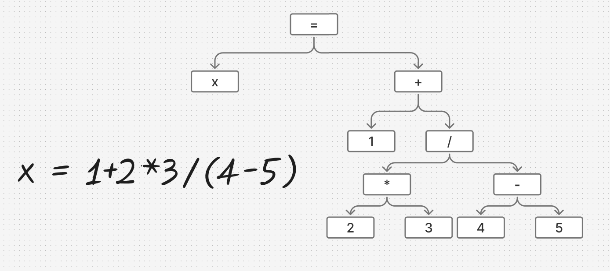
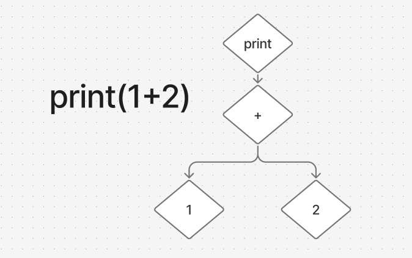
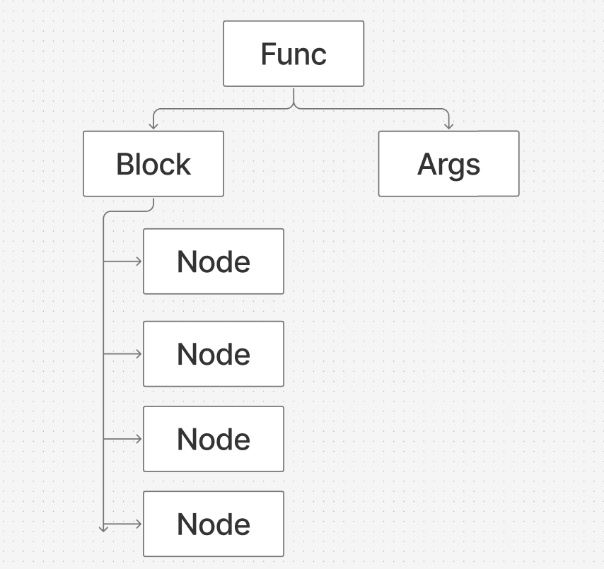
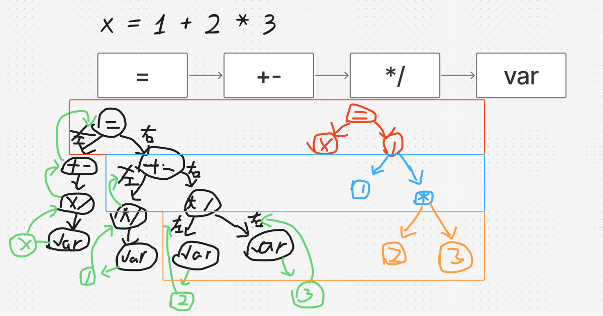
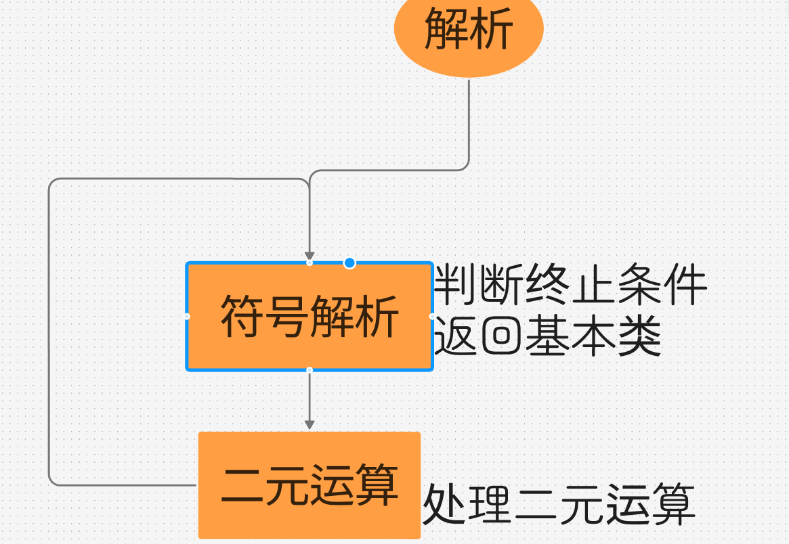
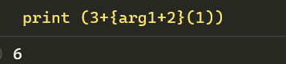
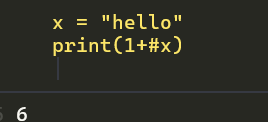

# Build on your own Language

从零开始构建自己的解释型编程语言

‍

首先选择一门用于构建语言的语言，go快速和高并发，kotlin可以用java的轮子功能丰富，python语法简单，lua轻量。

最后还是选择了python，感觉用它写起来比较方便，也可以再复习一下python，至少对我还说是这样。

‍

这个文章也是边学边写，可能很多内容并不标准，请见谅

‍

那么第一步就是创建一个py文件（

先要有语言的构思，不论怎么实现。

下面是我的设想

```c
// 1种单行注释
/* 一种多行注释 */

// 块 {}

// 有序表 [1,2,3]
// 无序表 [1 2 3]
// 哈希表 <"a":1,"x":"x">
// 局部变量 $ [在思考]
// 检查非空类型 !!
// 函数属于快f = {print(arg1)}
// 通过argN来获取变量，#args获取参数个数
// 返回值返回x：
// g = {
// x = 1+2
// x
// }
// 函数调用 x = f 1 
// y = g(1)
// 
// 获取值11.str
// "111".int
// 
// 只有1个类型u8


```

- 截至2025.5.24,实现了注释，块，部分运算，表，print函数的实现

‍

实现一门解释型语言大概分为3步，词法分析，语法分析，解析器


‍

然后写词法分析器Lexical Analyzer，一般语言都会先写这个

词法分析器应该是最简单的一部分，对于抽象语法树，语义分析器来说

‍

## 词法分析器

顾名思义就是分析“词”，官方用语叫Token

一个符号是token，变量是token，关键词也是token，所以这一步就是分析代码中的“词”，并标记为有意义的token保存起来

大部分教程直接使用了正则匹配进行分词，一行代码实现分析

但是考虑到我的代码可能会出现一些神秘语法，正则匹配可能会出现问题，而且不精细，所以用传统方式，遍历字符来实现

```py
index = 0
status = Status.nil

while True:
	if index >= len(code):
    	break
   	c = code[index]
   	two = code[index : index + 2]  # 这里一次记录两个字符，方便分析是不是双字符token，比如**
    match status:
        case Status.nil:
		...
		case ...

```

类似这样的结构，index是遍历的字符的位置，status是当前状态（比如当前token是个变量，关键词还是注释什么的），

注意这里要跳过空字符，注释也要跳过

> 可选，记录行和列，用于后续代码报错处理
>
> ```py
> if c in [" ", "\t"]:
>     pass
> elif c == "\n" or c == "\r":
>     line += 1
>     column = 0
> ```

### token类型

token类型可以定义成这种结构

```py
from enum import Enum, auto

class TokenType(Enum):
    var = auto()
    Keyword = auto()
    Operator = auto()

# TokenType.var 这样使用
```

最终返回一个token的list

例如（类型，字面量，行号，列号）

[(<TokenType.var: 1>, 'x', 5, 12),(<TokenType.Operator: 2>, '=', 5, 13),(\<TokenType.var: 1\>, '1', 5, 14)]

那么这一步就完成了

‍

## 语法分析器之AST语法树构建

这一部分比较抽象，先放个图



比如存在一个式子`x = 1+2*3/(4-5)`​，我们需要将其处理成包含优先级的解析好的结构

简单解释一下图片

首先是一个`=`​，他包含左右两个分支，左边是`x`​，右边是`+`​

​`+`​同理包含左边是1，右边是`/`​

​`/`​左边是`*`​，右边是`-`​

​`*`​左边是2，右边3

​`-`​左边4，右边5

于是我们就知道优先级最高的在最内层，符合递归的算法，从内到外运算，方便后续处理

‍

再比如

将`print(1+2)`​解析，也是同理

‍

So 这一步就是要将`token流`​变成`AST语法树`​

### Node节点

我们发现“树”中的元素都有一些分支，所以就有node的概念，将他们定义为节点，便于管理他们的关系

首先有个基础节点，所以节点都继承它

```py

class ASTNode:
    """AST 节点的基类"""

    def __init__(self, token=None):
        self.token = token  # 存一个token，方便获取

    def __repr__(self):  # 便于打印调试，用于打印时候格式化显示
        return self.__class__.__name__
```

‍

程序根节点，一般叫`ProjectNode`​，这里我将一切函数定义为FuncState，所以根节点也是个FuncState，后续方便适配命令行参数

```py
class FuncState(Statement):
	
    def __init__(self,token, block, args):
        super().__init__(token)
        self.block = block  # 块的概念，就是函数中的节点
        self.args = args  # 参数，传入函数的参数节点

    def __repr__(self):
        return f"FuncState(block={self.block},args={self.args})"


class BlockNode(ASTNode):
    """表示块的 AST 节点"""
    def __init__(self, statements=None):
        super().__init__()
        self.statements = statements if statements else []  # 空检测

    def __repr__(self):
        pr = ",\n".join(str(item) for item in self.statements)
        return f"{self.__class__.__name__}(\n{pr}\n)"


class ArgsNode(ASTNode):
	"""表示参数 AST 节点"""
    def __init__(self, token, args=None):
        super().__init__(token)
        self.args = args if args else []  # 空检测

    def __repr__(self):
        # pr=',\n'.join(str(item) for item in self.statements)
        return f"{self.__class__.__name__}({self.args})"

```

‍

所以我的根结构如下



其中每个node可以理解为每行的代码节点

‍

在实现AST解析器之前先需要个模板，定义一些工具方法

```py


class Parse_AST:
    """转换成AST语法树"""

    def __init__(self, lexers):
        self.lexers = lexers
        self.index = 0

    def parse(self):
        """解析"""
        # token参数0是类型，1是值，2是行号，3是列号;
        self.root = FuncState(self.peek(),self.parse_block(),ArgsNode(self.peek()))
        return self.root

    def next(self):
        """消费，获取下一个token"""
        if self.index + 1 >= len(self.lexers):
            return None
        self.index += 1
        return self.lexers[self.index]

    def see_next(self):
        """不消费，获取下一个token"""
        return (
            self.lexers[self.index + 1] if self.index + 1 < len(self.lexers) else None
        )

    def peek(self):
        """不消费，获取当前token"""
        if self.index >= len(self.lexers):
            return None
        return self.lexers[self.index]

    def is_end(self):
        """token流末尾"""
        return False if self.see_next() else True
```

这里消费的意思是将当前token向后移动一个

‍

### 解析函数

于是我们就要去实现各种解析方法如`parse_args`​，`parse_oper`​，`parse_block`​，`parse_keyword`​等等

```py
    def parse_block(self):
        root = BlockNode()
        while True:
            token = self.peek()
            match token[0]:
                case TokenType.Keyword:
                    node = self.parse_keyword()
                    root.statements.append(node)
                case TokenType.u8:
                    node = self.parse_u8()
                    root.statements.append(node)
                case TokenType.Operator:
                    node = self.parse_oper()
                    root.statements.append(node)
                case _:
                    raise SyntaxError(f"??? token: {token}")

            if self.is_end():
                break
```

这里不贴全部的代码了，基本是按照这个思路去实现

‍

这里重点介绍一下符号的解析也就是第一个示例的内容

### 符号解析

由于这里要考虑优先级，在示例中也提到递归的方法，所以这里解析也需要用到递归，将递归下降法

这里我是看代码才理解的，

```py
    def assign(self):
        """赋值语句"""
        name = self.peek()
        token = self.see_next()
        if token and token[1] == "=":
            name = name[1]
            self.next()
            self.next()
            value = self.assign()
            return OperExpr(token, name, value)
        return self.expr()

    # + -
    def expr(self):
		"""+ -运算"""
        node = self.term()  # next
        while self.peek()[1] in ["+", "-"]:
            op = self.peek()
            self.next()
            right = self.term()
            node = OperExpr(op, node, right)
        return node

    #* /
    def term(self):
		"""* /运算"""
        node = self.factor()  # next
        while self.peek()[1] in ["*", "/"]:
            op = self.peek()
            self.next()
            right = self.factor()
            node = OperExpr(op, node, right)
        return node

    def factor(self):
		"""基础元素"""
        token = self.peek()
        if token[0] == TokenType.u8:
            node = self.peek()
            self.next()
            return node
        raise SyntaxError(f"_factor token: {token}")
```

通过一步一步递归变成树结构



左边是递归过程，右边是解析的结构

可以发现优先级越高的应该越靠后解析

最终我解析出来的结构

​`x = 1+2*(3^4**5)-6/7%8`​

```py
OperExpr(oper='=',left='x',right=OperExpr(oper='-',left=OperExpr(oper='+',left=(<TokenType.u8: 1>, '1', 3, 9),right=OperExpr(oper='*',left=(<TokenType.
u8: 1>, '2', 3, 11),right=OperExpr(oper='^',left=(<TokenType.u8: 1>, '3', 3, 14),right=OperExpr(oper='**',left=(<TokenType.u8: 1>, '4', 3, 16),right=(<
TokenType.u8: 1>, '5', 3, 19))))),right=OperExpr(oper='%',left=OperExpr(oper='/',left=(<TokenType.u8: 1>, '6', 3, 22),right=(<TokenType.u8: 1>, '7', 3,
 24)),right=(<TokenType.u8: 1>, '8', 3, 26)))),

```

检查一下发现还是很清晰的

‍

## 解析器

一般这一步之前还有个语义分析器，用于检查ast语法树的正确性，代码错误的处理等等，但是作为一门能够适应各种语法特性的语言，一切语法皆可运行（~~主要是懒的写~~）

‍

这一步应该是最有趣的，因为这里可以看到你的语言真的在运行，在计算，在输出！

```py

class Interperter:
    def __init__(self, ast_root):
        self.ast_root = ast_root
        self._G = dict()

    def interpret(self):
        """解释器的主入口，开始遍历 AST"""
        self._visit_func(self.ast_root, self._G)
        return self._G

```

这里要去实现visit函数，也就是去遍历ast表完成解析功能`_visit_list`​，`_visit_args`​，`_visit_oper`​，`_visit_print`​

比如说一个print解析

```py
    def _visit_print(self, node, _Env):
        args = None

        if node.expression.__class__.__name__ == "ArgsNode":  # 多参数
            args = node.expression.args
        else:  # 错误
            raise SyntaxError("print 参数错误")

        print(" ".join(self._visit_args(args, _Env)))
```

直接打印出Print结构里的参数并解析参数

‍

这里有个函数作用域的问题

就是函数块内使用局部变量，函数内能访问到外部变量

```py
def _visit_func(self, funcNode, _Env):
        _Env = _Env.copy()  # 复制当前环境
```

这里解决方案是传入环境，并copy一份用于函数内部使用

‍

### 处理操作符

这里也用到了递归的方法



这里也不贴代码了，根据需求实现，我还处理了一元运算和列表，函数等运算

‍

最后请看我的神奇语言，已经完美的运行起来了





等我彻底完成后，会将源码开源在Github，[https://github.com/KuLiPai](https://github.com/KuLiPai)欢迎关注我:)

‍
