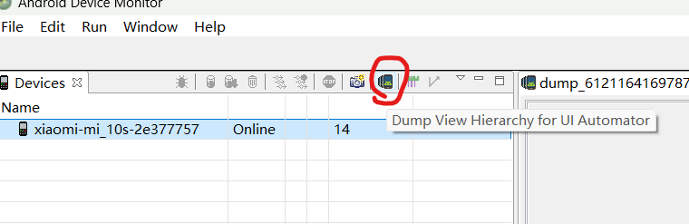
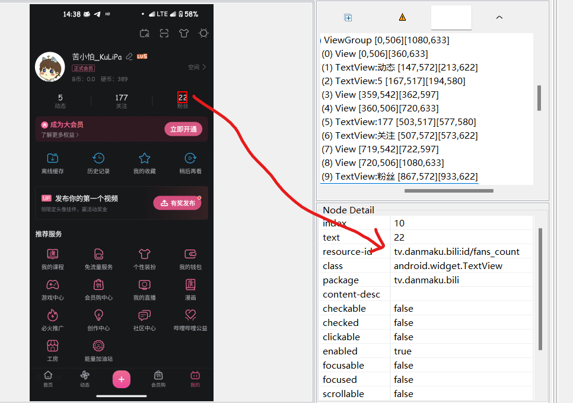
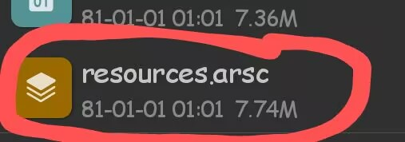
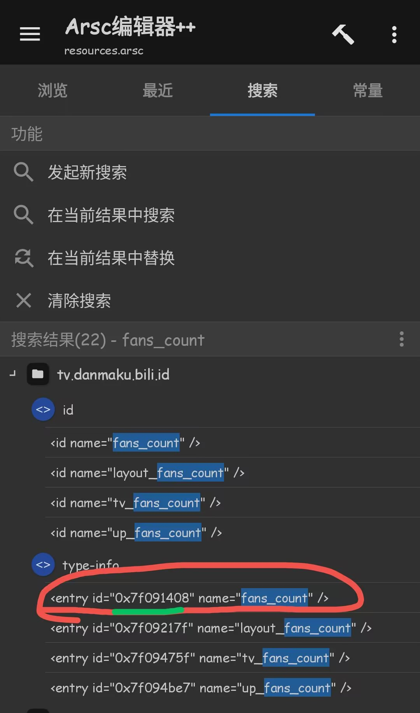
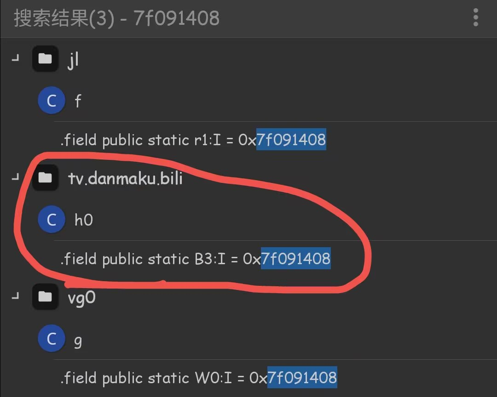
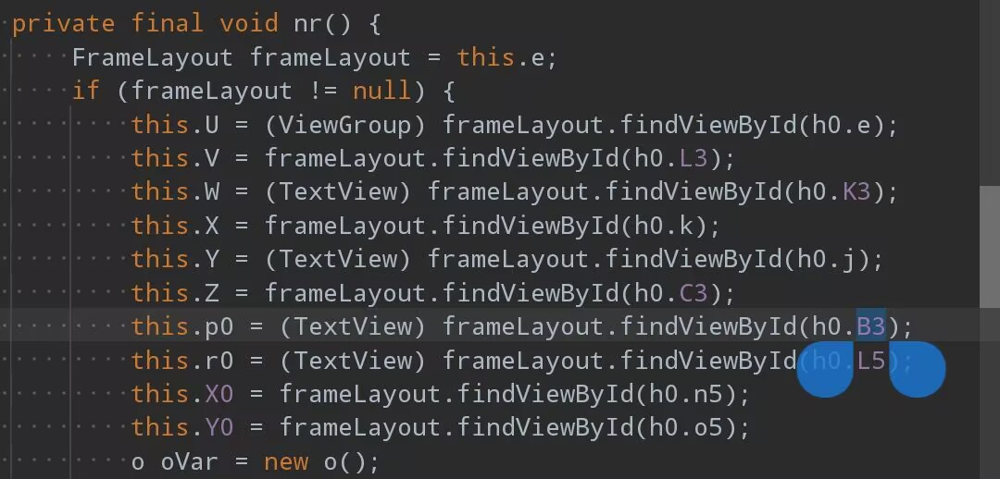
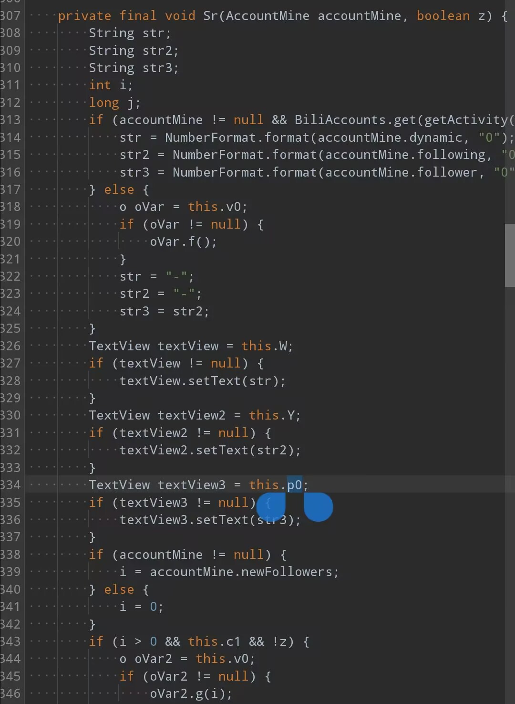

#

# B站Hook修改主页粉丝数

‍

## 准备工作

* 布局分析monitor/[Stethox](https://github.com/5ec1cff/StethoX)
* MT/NT管理器

## 分析B站布局

1. 打开 **USB调试** 连接手机
2. 启动b站打开我的页面，启动monitor查看布局



点击视图，查看资源id



可知就是`fans_count`

来到mt管理器b站apk里的`resources.arsc`文件Arsc++打开



搜索fans_count



得到资源id是`7f091408`​

回到apk，用dex++打开反编译所有dex

搜索这个id，（路径/，搜索类型：代码或整数十六进制，搜索子目录）

搜到3个结果，这里需要一个一个试了，我试出来是第二个



我们复制它的类继续搜`Ltv/danmaku/bili/h0;->B3`​，这里是搜调用处，类似交叉引用。（区分大小写，代码，路径/，搜索子目录）

就一个结果`tv/danmaku/bili/ui/main2/mine/HomeUserCenterFragment`​我们进入，反编译java代码。找到B3，



发现被绑定给了p0，在当前java里继续搜p0，



在Sr函数里，被`setText`了，str3是`accountMine.follower`​，于是就可以写代码了

```kotlin
 "tv.danmaku.bili.ui.main2.mine.HomeUserCenterFragment".hook(lpparam.classLoader, "Sr",
            "tv.danmaku.bili.ui.main2.api.AccountMine".findClass(lpparam.classLoader), Boolean::class.java, before = {
                //XposedBridge.log(it.args[0].toString()) //打印所有值
				it.args[0].setField("follower",99999999)
                it.args[0].setField("level",6)
            }
        )
```

我们还可以通过打印出`AccountMine`​的所有值来修改等级硬币数量等。


