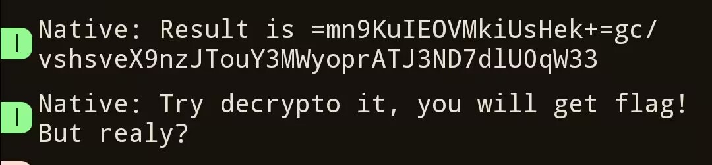
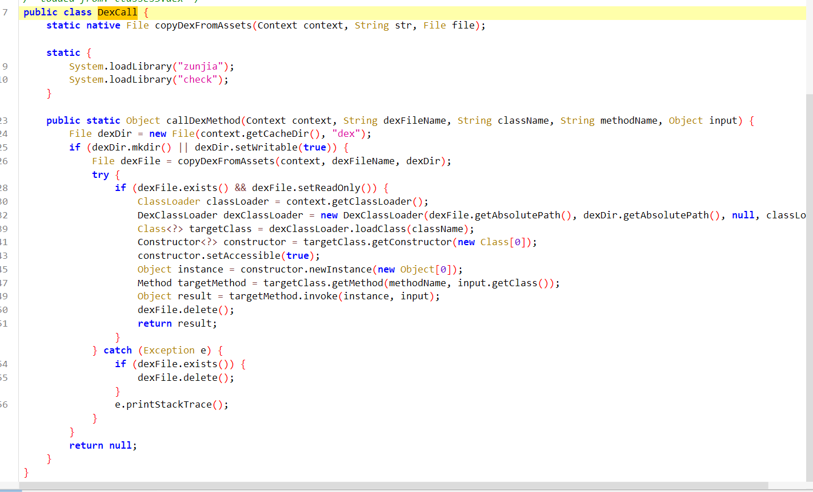
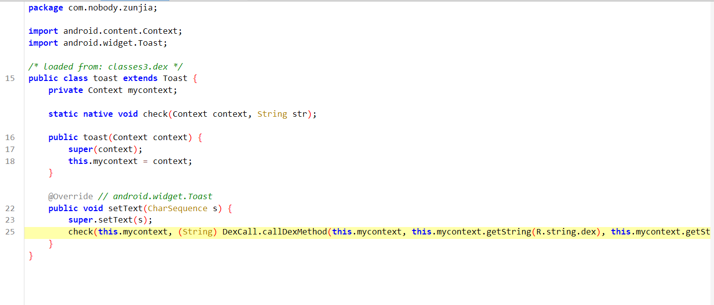
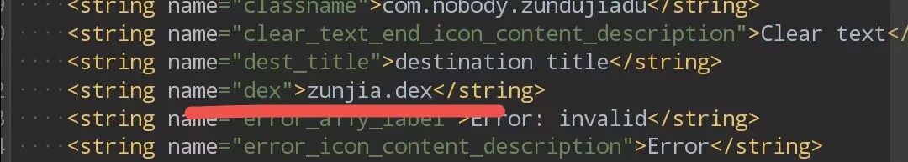
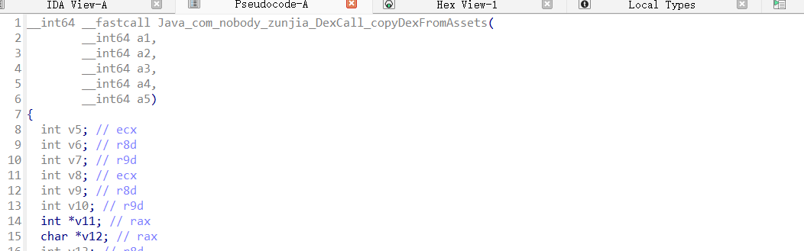
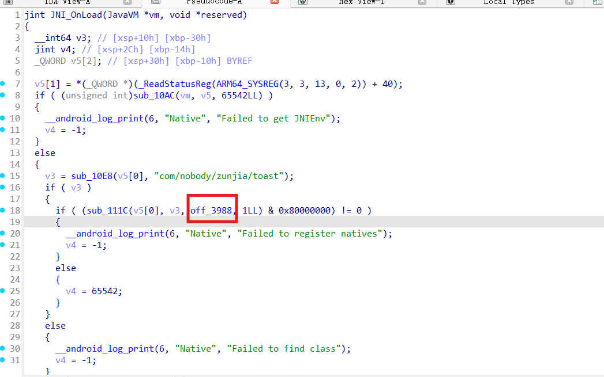
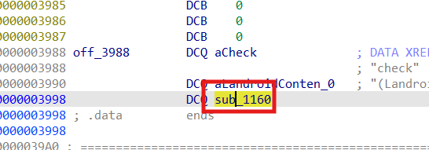
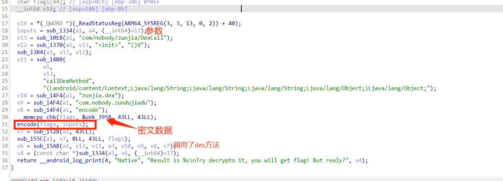
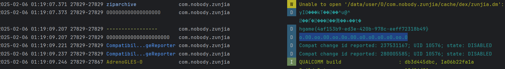

## 尊嘟假嘟

1.运气解法（

乱点就能得到flag，o.00.oo.00.oo.0o.00.o0.o0.o0.o0.oo.0按顺序点完

将log输出再调dex的decoode方法即可得到flag

2.普通解法

我们随便点点app发现在log里输出了，每次都是60字符，结尾大概率有“33”（最后发现是魔改base64换标然后把==替换成33了好像）

​​

首先分析一下apk，有一个DexCall类，加载了两个so文件，并且用so处理并复制一个dex到私有路径并加载dex，调用一个方法后删除dex。

​​

还有个toast类，里面有个native的**check**方法​

```java
 check(this.mycontext, (String) DexCall.callDexMethod(this.mycontext, this.mycontext.getString(R.string.dex), this.mycontext.getString(R.string.classname), this.mycontext.getString(R.string.func1), s));
//这里的字符串都可以在resources.arsc里找到，
```

比如`this.mycontext.getString(R.string.dex)`​在`resources.arsc`​里的`com.nobody.zunjia/string/string.xml`​

​​

复原后就是

```java
 (String) DexCall.callDexMethod("zunjia.dex"，"com.nobody.zundujiadu", "encode", s);
```

在apk里确实有`../public/zunjia.dex`​，但是格式错误，因为dex被加密，解密在zunjia.so里实现

​​

这里暂时没必要分析，只需要知道zunjia,so用于解密dex即可。

那么显然check函数是关键，在check.so里实现，，注意一点传入的字符串先经过dex加密了一次。

分析check.so

​​

​​

​​

找到加密的地方了，这里标出了encode的函数，以及密文

```java
[0x7A, 0xC7, 0xC7, 0x94, 0x51, 0x82, 0xF5, 0x99, 0x0C, 0x30, 0xC8, 0xCD, 0x97, 0xFE, 0x3D, 0xD2, 0xAE, 0x0E, 0xBA, 0x83, 0x59, 0x87, 0xBB, 0xC6, 0x35, 0xE1, 0x8C, 0x59, 0xEF, 0xAD, 0xFA, 0x94, 0x74, 0xD3, 0x42, 0x27, 0x98, 0x77, 0x54, 0x3B, 0x46, 0x5E, 0x95]
```

首先用传参处理固定key，然后用key处理(解密)一段字符，最后再调用dex的encode方法将结果log输出。

将他转换成py就是

```python

def encode(a1, keys):
    a_len = len(a1)
    v6 = 0
    v5 = 0
    a1_bytes = bytearray(a1) 
    for i in range(a_len):
        v6 = (v6 + keys[v6 + 1]) % 256 
        keys[v6], keys[v5] = keys[v5], keys[v6]  
        a1_bytes[i] ^= keys[(keys[v6] + keys[v5]) % 256]
    a1_list = list(a1_bytes)
    a1_modified = bytes(a1_bytes)
    return a1_list 

def enkeys(a1):
    keys = list(range(256)) 
    result = len(a1) 
    var1 = bytearray(256) 
    for j in range(256):
        var1[j] = ord(a1[j % result])  
    var2 = 0
    for k in range(256):
        var3 = (var2 + keys[k] + var1[k]) & 0xFF
        var2 = var3
        keys[k], keys[var3] = keys[var3], keys[k]
    return keys  
```

于是我们就理清了加密逻辑，输入->调dex函数->so加密密钥->so魔改rc4->调dex函数

由于check函数不check，我们就需要自己爆破了

由题目可知，是0.o和o.0的组合，最大不超过36个字符，只需要模拟它的加密过程并判断有没有hgame开头的flag即可

‍

这里dex加密还没解决，于是我突发奇想，用相同包名，复制它的代码，自己写个app即可调用dex方法。

包名用`com.nobody.zunjia`​，将dex和so放在assets和jniLibs里

```python
│  AndroidManifest.xml
│
├─assets
│      zunjia.dex
│
├─java
│  └─com
│      └─nobody
│          └─zunjia
│                  DexCall.java
│                  Encoder.java
│                  MainActivity.java
│                  toast.java
│
├─jniLibs
│  ├─arm64-v8a
│  │      libcheck.so
│  │      libzunjia.so
│  │
│  ├─armeabi-v7a
│  │      libcheck.so
│  │      libzunjia.so
│  │
│  ├─x86
│  │      libcheck.so
│  │      libzunjia.so
│  │
│  └─x86_64
│          libcheck.so
│          libzunjia.so
```

这里我们用java实现一些上述python的算法

```java
package com.nobody.zunjia;

import java.util.ArrayList;
import java.util.List;

public class Encoder {

    // 实现加密功能，使用 RC4 算法的 PRGA 部分
    public static byte[] encode(List<Integer> a1, List<Integer> keys) {
        int aLen = a1.size();
        // 初始化 PRGA 中的 i 和 j
        int i = 0;
        int j = 0;

        // 将输入的整数列表转换为字节列表，便于后续操作
        List<Byte> a1Bytes = new ArrayList<>();
        for (int val : a1) {
            a1Bytes.add((byte) val);
        }

        // 遍历输入的每个字节
        for (int index = 0; index < aLen; index++) {
            // 更新 i 的值，确保在 0 - 255 范围内
            i = (i + 1) % 256;
            // 更新 j 的值，确保在 0 - 255 范围内
            j = (j + keys.get(i)) % 256;

            // 交换 keys[i] 和 keys[j] 的值
            int temp = keys.get(i);
            keys.set(i, keys.get(j));
            keys.set(j, temp);

            // 计算异或操作的索引
            int xorIndex = (keys.get(i) + keys.get(j)) % 256;
            // 对当前字节进行异或操作
            byte xorResult = (byte) (a1Bytes.get(index) ^ keys.get(xorIndex));
            // 更新当前字节的值
            a1Bytes.set(index, xorResult);
        }

        // 将字节列表转换为字节数组
        byte[] byteArray = new byte[a1Bytes.size()];
        for (int index = 0; index < a1Bytes.size(); index++) {
            byteArray[index] = a1Bytes.get(index);
        }

        return byteArray;
    }

    // 实现 RC4 算法的 KSA 部分，生成初始的密钥流
    public static List<Integer> enkeys(String a1) {
        // 初始化密钥列表，范围从 0 到 255
        List<Integer> keys = new ArrayList<>();
        for (int i = 0; i < 256; i++) {
            keys.add(i);
        }

        // 初始化 j 的值
        int j = 0;
        // 获取密钥字符串的长度
        int keyLength = a1.length();

        // 遍历 0 到 255 的索引
        for (int i = 0; i < 256; i++) {
            // 更新 j 的值，确保在 0 - 255 范围内
            j = (j + keys.get(i) + (a1.charAt(i % keyLength) & 0xFF)) % 256;

            // 交换 keys[i] 和 keys[j] 的值
            int temp = keys.get(i);
            keys.set(i, keys.get(j));
            keys.set(j, temp);
        }

        return keys;
    }
}
```

优化一下dexcall类，防止爆破时候爆缓存，只读取和解密一次dex。

```java
package com.nobody.zunjia;


import android.content.Context;
import dalvik.system.DexClassLoader;
import java.io.File;
import java.lang.reflect.Constructor;
import java.lang.reflect.Method;

public class DexCall {
    private static File dexFile;
    private static DexClassLoader dexClassLoader;

    static native File copyDexFromAssets(Context context, String str, File file);

    static {
        System.loadLibrary("zunjia");
        System.loadLibrary("check");
    }

    public static void init(Context context, String dexFileName) {
        File dexDir = new File(context.getCacheDir(), "dex");
        if (dexDir.mkdir() || dexDir.setWritable(true)) {
            dexFile = copyDexFromAssets(context, dexFileName, dexDir);
            if (dexFile != null && dexFile.exists() && dexFile.setReadOnly()) {
                dexClassLoader = new DexClassLoader(
                        dexFile.getAbsolutePath(),
                        dexDir.getAbsolutePath(),
                        null,
                        context.getClassLoader()
                );
            }
        }
    }

    public static void cleanup() {
        if (dexFile != null && dexFile.exists()) {
            dexFile.delete();
        }
    }

    public static Object callDexMethod(String className, String methodName, Object input) {
        if (dexClassLoader == null) {
            throw new IllegalStateException("DexClassLoader not initialized. Call init() first.");
        }

        try {
            Class<?> targetClass = dexClassLoader.loadClass(className);
            Constructor<?> constructor = targetClass.getConstructor();
            constructor.setAccessible(true);
            Object instance = constructor.newInstance();
            Method targetMethod = targetClass.getMethod(methodName, input.getClass());
            return targetMethod.invoke(instance, input);
        } catch (Exception e) {
            e.printStackTrace();
            return null;
        }
    }
}
```

在main里爆

```java
  		DexCall.init(this,"zunjia.dex");

        for (int length = 1; length < 13; length++) {
        
            for (int i = 0; i < (int) Math.pow(2, length); i++) {
           
                String binaryStr = Integer.toBinaryString(i);
            
                while (binaryStr.length() < length) {
                    binaryStr = "0" + binaryStr;
                }
                String abStr = binaryStr.replace("0", "0.o").replace("1", "o.0");

                if (superEncode(abStr).contains("hgame")) {
                    Log.d("-----------------",superEncode(abStr));
                    Log.d("000000000000000000000",abStr);
                    break;
                }


            }
        }


 public String superEncode(String s) {
        String a = (String) DexCall.callDexMethod( "com.nobody.zundujiadu", "encode", s);
        List<Integer> keys = Encoder.enkeys(a); // 调用 Encoder.enkeys
        List<Integer> input_string = Arrays.asList(0x7A, 0xC7, 0xC7, 0x94, 0x51, 0x82, 0xF5, 0x99, 0x0C, 0x30, 0xC8, 0xCD, 0x97, 0xFE, 0x3D, 0xD2, 0xAE, 0x0E, 0xBA, 0x83, 0x59, 0x87, 0xBB, 0xC6, 0x35, 0xE1, 0x8C, 0x59, 0xEF, 0xAD, 0xFA, 0x94, 0x74, 0xD3, 0x42, 0x27, 0x98, 0x77, 0x54, 0x3B, 0x46, 0x5E, 0x95);
    	return new  String(Encoder.encode(input_string, keys)); // 调用 Encoder.encode
    }

```

运行一次app，然后在log里即可看到flag

​​

当然优化的dexcall函数让dex就解密了在私有路径下/data/user/0/com.nobody.zunjia/cache/dex/zunjia.dex

也就可以自己实现他的算法爆破了。

‍
