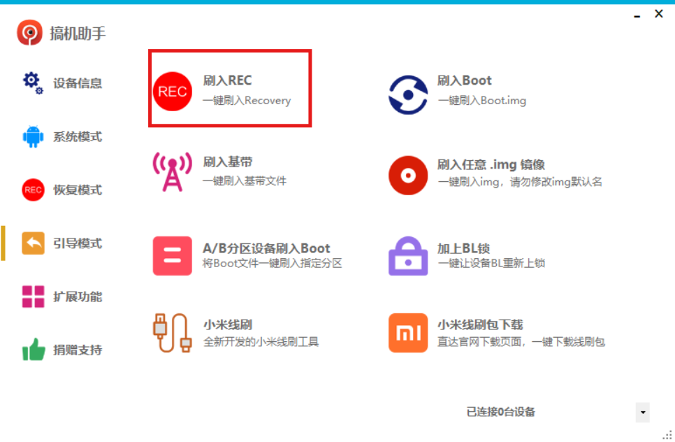
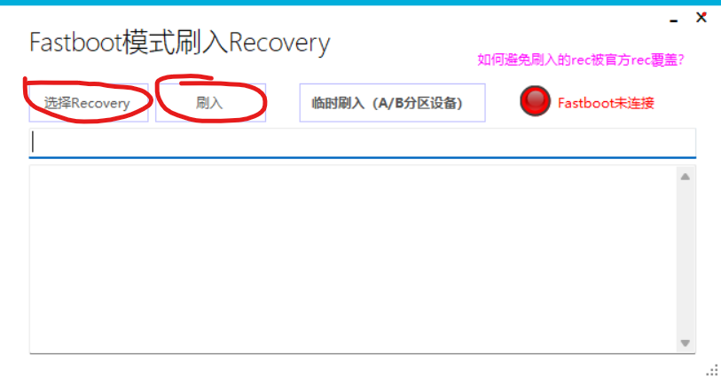
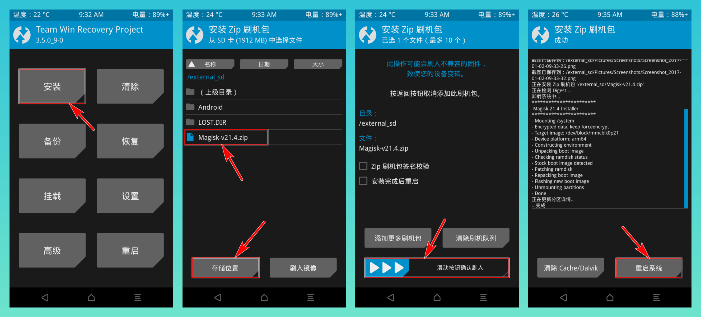
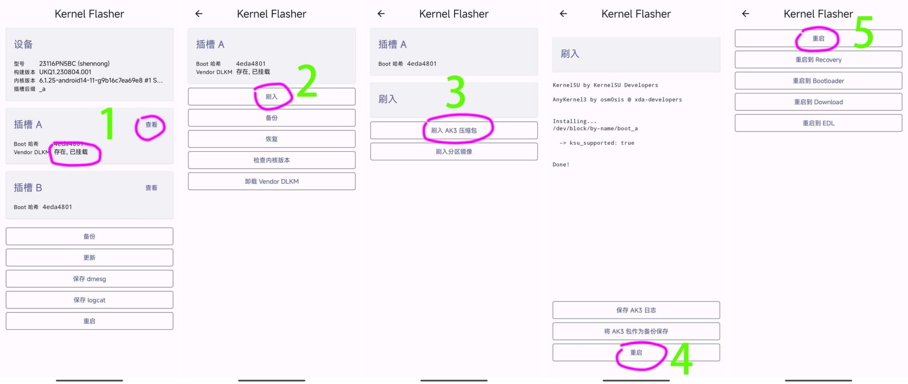
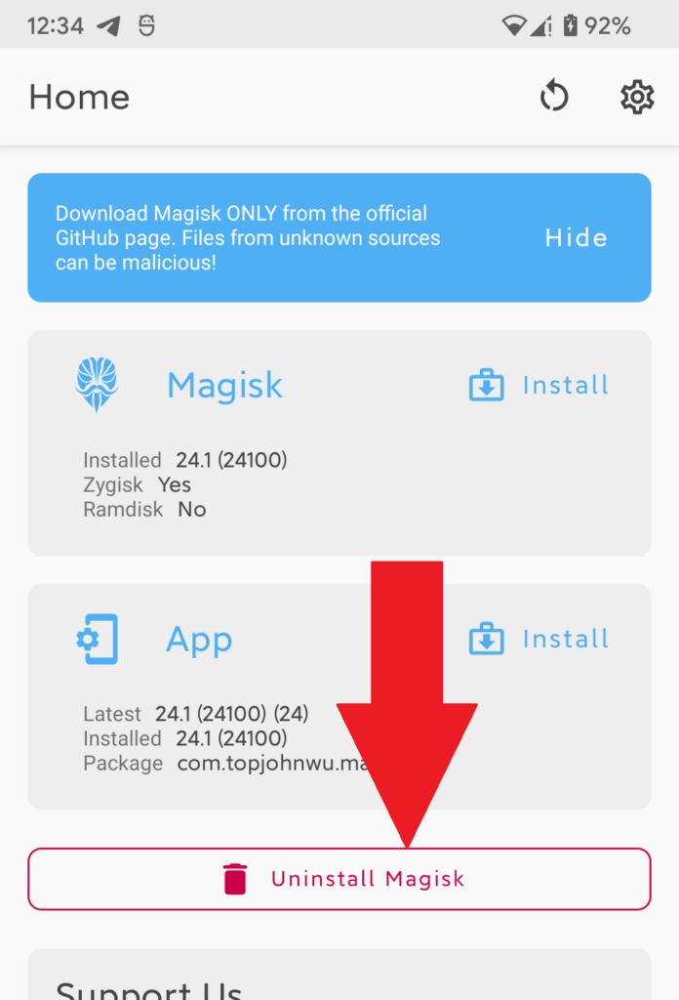

# 

黑砖和Magisk和KernelSU教程（

‍

## 刷前须知

刷机有风险，刷机需谨慎。

刷机前一定要备份好数据，系统镜像boot等等。

> 愿你刷机半身，归来仍是类原生。                                                        --我自己

## 1.开启adb调试

手机打开设置/关于手机/版本信息，版本号 连续点击7次  返回设置   搜索开发者选项，进入开发者-OEM解锁打开-USB调试打开，手机有弹窗调试点一律允许调试确定。

‍

## 2.解bl锁

这里用到工具[搞机助手](https://lsdy.top/gjzs)，需要自己安装adb和fastboot工具链

将手机通过数据线连接电脑

在工具箱看到连接到设备后点 `系统模式下重启到 引导模式`​（也就是fastboot模式)

等待手机进入引导模式，在终端输入`fastboot flashing unlock`​（请确保已经安装了fastboot命令，并连接到了设备，通过fastboot devices查看设备）

然后在手机上通过音量键上下选择，开机键确认下面的选项

即可解bl

‍

## 3.刷入twrp

还是来到引导模式，在助手里如下操作，其中Recovery要自己找自己手机适配的twrp包

​​

​​

刷入后重启到恢复模式（rec模式）

‍

## 4.刷入Magisk

​

将[Magisk](https://github.com/topjohnwu/Magisk)的apk改名成zip后缀传入手机目录，然后如下操作

​​

开机后自行安装Magisk的apk即可。

‍

## 4.1黑砖

！！！！（危险操作）！！！！

！！！！下一步请看5！！！！

在恢复模式点右下角`重启`​，切换槽位B，重启即可黑砖。

原因：**对于一加Ace3V机型，切换到B槽之后，由于B槽本来就是空的，所以切换后，会卡死在9008模式无限重启。**

**查询是否支持AB槽：**

```shell
// 方法1：
adb shell getprop ro.boot.slot_suffix
// 如果返回值为空，说明手机不支持 A/B 分区。如果返回值为 `_a` 或 `_b`，说明手机支持 A/B 分区。

// 方法2：
fastboot getvar current-slot
// 如果返回值为“current-slot:”，后面没有跟着A/B，说明手机不支持 A/B 分区。

// 方法3：直接试着切换
fastboot --set-active=other
// 如果返回值为“fastboot: error: Device does not support slots”，说明手机不支持 A/B 分区。
```

**切换AB槽：**

```shell
fastboot --set-active=other
```

**并且，如果你尝试给B槽刷入系统，会遇到Dynamic Partition空间不足的错误！因为一加Ace 3V留给Super分区的空间本来就不够。**

**所以不要切换到B槽！**

‍

## 5.刷入KernelSU

!!!Magsik和KernelSU都是root管理器，都能实现几乎相同的功能，但是在root的隐藏方面KernelSU更胜一筹。

*注:如果你只需要root而没有隐藏需求那Mgaisk就够用了。如果你需要日用等可以考虑KernelSU*

这里使用`内核刷写 App 安装`​安装刷入（需要手机内核大于等于5.10）

‍

‍

1. 下载对应AnyKernel3（这个可在https://github.com/tiann/KernelSU/releases/里找，推荐找自编译有本机型测试过的）

    ！！！！！！！请仔细阅读[官方文档](https://kernelsu.org/zh_CN/guide/installation.html#install-by-kernel-flasher)！！！！！！
2. 下载[KernelFlasher](https://github.com/capntrips/KernelFlasher/releases)
3. 给KernelFlasher，root权限，并刷入内核，步骤如下（AK3包为第一步下载的AnyKernel3）

    ​​
4. 在Magisk里选择卸载，`完全卸载`​​
5. 重启后下载[KernelSU管理器](https://github.com/tiann/KernelSU/releases)的apk，打开看到上方显示工作中GKI，那么就成功了！

‍

## 结语

本教程可能只适用于特定机型。

关于刷写KernelSU的方法还有很多，可以参考[官方文档](https://kernelsu.org/zh_CN/guide/installation.html)。

‍
