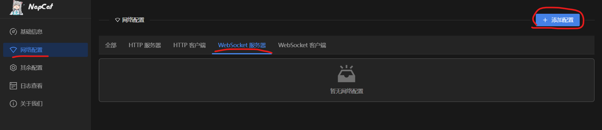

# 从零开始QQ BOT搭建

本教程使用NapNeko/NapCat，Linux服务器搭建

https://github.com/NapNeko/NapCatQQ?tab=readme-ov-file

# 1.准备工作

服务器/本地主机/安卓Termux，一个爱折腾的心

# 2.开始安装

https://napneko.github.io/guide/start-install

NapCat有两种安装方式**Framework**和**Shell** 

这里使用shell安装

Linux安装：

`curl -o [napcat.sh](http://napcat.sh/) [https://nclatest.znin.net/NapNeko/NapCat-Installer/main/script/install.sh](https://nclatest.znin.net/NapNeko/NapCat-Installer/main/script/install.sh) && sudo bash [napcat.sh](http://napcat.sh/)`

# 3.基础配置

安装好后，输入`napcat` 获取帮助

常用的命令有：

```python
 napcat start {QQ}                     启动对应QQ号的NAPCAT
 napcat stop {QQ}[可选]                停止所有[对应QQ号]的NAPCAT及DLC
 napcat restart {QQ}                   重启对应QQ号的NAPCAT
 napcat status {QQ}[可选]              查看所有[对应QQ号]的NAPCAT
 napcat log {QQ}                       查看对应QQ号的NAPCAT日志
```

首先需要一个qq账号用于bot，输入 `napcat start {QQ}` ，启动服务，并根据提示登录qq。

登录好后，通过`napcat log {QQ}` 查看日志，会看到一条 `[WebUi] WebUi Local Panel Url: http://127.0.0.1:6099/webui?token=xxxx` 的信息，这里url是webUI的地址。

- 如果是本地，就访问`http://127.0.0.1:6099/webui?token=xxxx`
- 如果是服务器，需要添加安全组开放6099端口，然后访问：公网`ip:6099/webui?token=xxxx`



在Web面板中添加一个WebSocket服务，端口不冲突就行，我这里用6299.

# 4.Bot开发

这里我们开启了WebSocket服务，需要一个对接的脚本，这里提供一个python的demo

```python
import asyncio
import json
import websockets
import platform
import os

# 配置 NapNeko WebSocket 地址
NAPNEKO_WS_URL = "ws://127.0.0.1:6299/"

# 消息处理逻辑
async def handle_message(message):
    # 将接收到的消息解析为字典
    data = json.loads(message)

    # 判断是否为消息事件
    if data.get("post_type") == "message":
        message_type = data.get("message_type")
        raw_message = data.get("raw_message")
        user_id = data.get("user_id")
        sender_nickname = data.get("sender", {}).get("nickname", "未知昵称")

        # 私聊消息
        if message_type == "private":
            print(f"收到私聊消息：{raw_message}，来自用户 {user_id}（昵称：{sender_nickname}）")
            await send_private_message(user_id, f"你发送的消息是：{raw_message}")

        # 群聊消息
        elif message_type == "group":
            group_id = data.get("group_id")
            print(f"收到群聊消息：{raw_message}，来自群 {group_id} 的用户 {user_id}（昵称：{sender_nickname}）")
            if raw_message == "你好":
                await send_group_message(group_id, f"{sender_nickname}，你好！")
            #await send_group_message(group_id, f"群 {group_id} 的成员 {sender_nickname} 说：{raw_message}")

# 发送私聊消息
async def send_private_message(user_id, message):
    payload = {
        "action": "send_private_msg",
        "params": {
            "user_id": user_id,
            "message": message
        }
    }
    async with websockets.connect(NAPNEKO_WS_URL) as ws:
        await ws.send(json.dumps(payload))
        response = await ws.recv()
        print(f"私聊消息发送响应：{response}")

# 发送群聊消息
async def send_group_message(group_id, message):
    payload = {
        "action": "send_group_msg",
        "params": {
            "group_id": group_id,
            "message": message
        }
    }
    async with websockets.connect(NAPNEKO_WS_URL) as ws:
        await ws.send(json.dumps(payload))
        response = await ws.recv()
        print(f"群聊消息发送响应：{response}")
# 发送消息函数
async def send_message(user_id, message):
    # 构造发送消息的 payload，根据 API 文档定义
    payload = {
        "action": "send_message",
        "data": {
            "receiver_id": user_id,
            "message": message,
        }
    }

    # 通过 WebSocket 发送
    async with websockets.connect(NAPNEKO_WS_URL) as ws:
        await ws.send(json.dumps(payload))
        response = await ws.recv()
        print(f"发送消息的响应：{response}")

# 主函数，用于连接 WebSocket 并处理消息
async def main():
    async with websockets.connect(NAPNEKO_WS_URL) as ws:
        print("已连接到 NapNeko WebSocket 服务")
        while True:
            try:
                # 等待接收消息
                message = await ws.recv()
                print(f"收到消息：{message}")

                # 处理消息
                await handle_message(message)
            except websockets.ConnectionClosed:
                print("连接关闭，正在尝试重连...")
                break

# 启动 WebSocket 监听
if __name__ == "__main__":
    asyncio.run(main())
```

运行它`python bot.py` 如果想在后台运行可以用`nohup python bot.py &` ，日志会默认输出到`nohup.out` 

现在就可以对你的bot发消息了，私发消息回复`你发送的消息是：...` ,群消息发`你好` ，回复`...,你好！` 。

到这里就大功告成了！

# 5.注意事项

如果bot的号是新号，那么极有可能被冻结，但是不要慌，基本人脸识别一次都能解封。可以先登录bot号多发点消息图片加点好友/群（然后再退了
