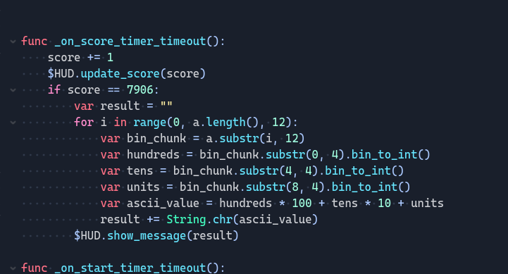
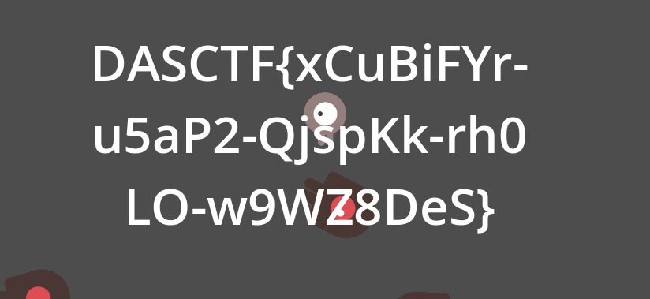
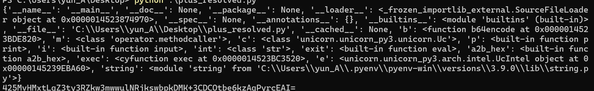

# 羊城杯

## GD1

用Godot RE Tool逆向出gd代码，发现当分数\=7906显示flag



用cheat engine改分数到7906，发现flag



DASCTF{xCuBiFYr-u5aP2-QjspKk-rh0LO-w9WZ8DeS}

## PLUS

这里使用了完全不需要逆向的方法(

分析plus.py代码

首先将所有加法计算出来。

打印globals()，发现

int改为了str,

exit-\>eval,

i-\>input等等



将代码按照这些函数执行的功能化简，最终如下

```Python
from init import *;


m("mem_map",16777216,2097152)(e);
m("mem_map",18874368,65536)(e);
m("mem_write",16777216,b'\xf3\x0f\x1e\xfaUH\x89\xe5H\x89}\xe8\x89u\xe4\x89\xd0\x88E\xe0\xc7E\xfc\x00\x00\x00\x00\xebL\x8bU\xfcH\x8bE\xe8H\x01\xd0\x0f\xb6\x00\x8d\x0c\xc5\x00\x00\x00\x00\x8bU\xfcH\x8bE\xe8H\x01\xd0\x0f\xb6\x002E\xe0\x8d4\x01\x8bU\xfcH\x8bE\xe8H\x01\xd0\x0f\xb6\x00\xc1\xe0\x05\x89\xc1\x8bU\xfcH\x8bE\xe8H\x01\xd0\x8d\x14\x0e\x88\x10\x83E\xfc\x01\x8bE\xfc;E\xe4r\xac\x90\x90]',)(e);
m("reg_write",44,18939903)(e);
m("mem_write",18878464, input().encode())(e);
m("reg_write",39,18878464)(e);
m("reg_write",43,44)(e);
m("reg_write",40,7)(e);
m("emu_start", 16777216, 16777332)(e);
print(b(m("mem_read", 18878464, 44)(e)).decode())
print("good") if (b(m("mem_read", 18878464, 44)(e)).decode()== '425MvHMxtLqZ3ty3RZkw3mwwulNRjkswbpkDMK+3CDCOtbe6kzAqPyrcEAI=') else print('no way!') #type:ignore
```

通过模拟执行执行了代码加密了输入与密文对比

这里通过在源代码基础上爆破获取flag

```Python
from init import *
import sys

# ========== 可配置项 ==========
# 如果你知道起始的固定 prefix（例如 "D" 或 "DASCTF{" 等），把它放这儿；
# 如果不知道第一个字符，请设为 ""（脚本将从第 0 位开始爆破）。
BASE_PREFIX = (
    ""  # <-- 改成 "D" 或 "D" + mm 等以固定已知起始；默认空表示从第1字符开始自动爆破
)

# 保护上限：最大轮数，防止无限循环
MAX_ROUNDS = 512

# candidate 字符集（保留你原来 32..168 的范围）
ASCIIS = "".join([chr(i) for i in range(32, 169)])
# ==============================

# ========== 原始初始化（保留你原来的内存/寄存器/代码） ==========
print(globals())
answer = "425MvHMxtLqZ3ty3RZkw3mwwulNRjkswbpkDMK+3CDCOtbe6kzAqPyrcEAI="
m("mem_map", 16777216, 2097152)(e)
m("mem_map", 18874368, 65536)(e)
m(
    "mem_write",
    16777216,
    b"\xf3\x0f\x1e\xfaUH\x89\xe5H\x89}\xe8\x89u\xe4\x89\xd0\x88E\xe0\xc7E\xfc\x00\x00\x00\x00\xebL\x8bU\xfcH\x8bE\xe8H\x01\xd0\x0f\xb6\x00\x8d\x0c\xc5\x00\x00\x00\x00\x8bU\xfcH\x8bE\xe8H\x01\xd0\x0f\xb6\x002E\xe0\x8d4\x01\x8bU\xfcH\x8bE\xe8H\x01\xd0\x0f\xb6\x00\xc1\xe0\x05\x89\xc1\x8bU\xfcH\x8bE\xe8H\x01\xd0\x8d\x14\x0e\x88\x10\x83E\xfc\x01\x8bE\xfc;E\xe4r\xac\x90\x90]",
)(e)
m("reg_write", 44, 18939903)(e)
print("answer =", answer)
# ===============================================================


# === 工具函数：对 prefix + candidate 做一次写入/执行/读取，返回 (匹配前缀长度, enc) ===
def score_candidate(prefix: str, candidate: str):
    payload = (prefix + candidate).encode()
    m("mem_write", 18878464, payload)(e)
    m("reg_write", 39, 18878464)(e)
    m("reg_write", 43, 44)(e)
    m("reg_write", 40, 7)(e)
    m("emu_start", 16777216, 16777332)(e)
    enc = b(m("mem_read", 18878464, 44)(e)).decode(errors="ignore")
    # 计算 enc 与 answer 的共同前缀长度（从头开始比较）
    cnt = 0
    for k in range(min(len(enc), len(answer))):
        if enc[k] == answer[k]:
            cnt += 1
        else:
            break
    return cnt, enc


# === 找出给定 prefix 下所有候选字符的分数，返回 (max_value, candidate_list, counts_list) ===
def find_best_candidates(prefix: str):
    counts = []
    for ch in ASCIIS:
        cnt, _ = score_candidate(prefix, ch)
        counts.append(cnt)
    maxv = max(counts)
    indices = [i for i, v in enumerate(counts) if v == maxv]
    candidates = [ASCIIS[i] for i in indices]
    return maxv, candidates, counts


# === 并列候选的前瞻决胜（向前看 1 步） ===
# 对每个并列候选 ch：模拟 prefix + ch，然后计算下一轮所有候选的并列数量（next_tied_count）
# 选择 next_tied_count 最小的 ch；若相同则按 ASCII 最小
def tie_break_by_lookahead(prefix: str, tied_chars):
    best_char = None
    best_next_tied = None
    for ch in tied_chars:
        new_prefix = prefix + ch
        next_counts = []
        for nx in ASCIIS:
            cnt, _ = score_candidate(new_prefix, nx)
            next_counts.append(cnt)
        next_max = max(next_counts)
        next_tied_count = sum(1 for v in next_counts if v == next_max)
        if (
            best_next_tied is None
            or next_tied_count < best_next_tied
            or (next_tied_count == best_next_tied and ch < best_char)
        ):
            best_next_tied = next_tied_count
            best_char = ch
    return best_char, best_next_tied


# === 主流程 ===
def auto_bruteforce(base_prefix: str = ""):
    """
    自动爆破流程：
    1) 如果 base_prefix 为空，则先自动确定第一个字符（从 position 0 开始）。
       否则，从 base_prefix 开始逐位爆破下一个字符。
    2) 每轮选取匹配前缀长度最大的字符；若并列，使用 tie_break_by_lookahead 决胜。
    3) 遇到 '}' 或达到 MAX_ROUNDS/长度保护时停止。
    """
    prefix = base_prefix
    rounds = 0

    print("自动爆破开始。初始 prefix =", repr(prefix))
    # 如果 base_prefix 为空，要先确定第 0 个字符（相当于“第一个字符也不知道”的场景）
    # 我们把这个当作普通的第一轮：find_best_candidates(prefix) 会在 prefix 末尾追加测试字符
    while rounds < MAX_ROUNDS:
        rounds += 1
        print("\n[轮 %d] 当前 prefix(len=%d): %s" % (rounds, len(prefix), repr(prefix)))
        maxv, candidates, counts = find_best_candidates(prefix)
        print("  本轮 max_value =", maxv, " 并列候选数 =", len(candidates))
        # 打印候选（如果候选很多，只列前 80 个）
        sys.stdout.write("  候选（前显示）: ")
        for c in candidates[:80]:
            sys.stdout.write(repr(c) + " ")
        if len(candidates) > 80:
            sys.stdout.write("... (共 %d 个)" % len(candidates))
        sys.stdout.write("\n")

        if len(candidates) == 0:
            print("  无候选，停止。")
            break

        if len(candidates) == 1:
            chosen = candidates[0]
            print("  唯一候选 ->", repr(chosen))
        else:
            # 并列：用前瞻 1 步规则决胜
            chosen, next_tied = tie_break_by_lookahead(prefix, candidates)
            print(
                "  并列候选，通过前瞻选 ->",
                repr(chosen),
                " （前瞻下轮并列数 =",
                next_tied,
                "）",
            )

        # 追加选择
        prefix += chosen

        # 打印追加后一次真实的 enc（方便观察）
        _, enc_now = score_candidate(prefix[:-1], prefix[-1])
        print("  追加后 enc 前 80 字符:", enc_now[:80])

        # 终止条件：如果选到右花括号 '}'，认为 flag 结束（常见）
        if chosen == "}":
            print("检测到 '}'，可能已完成 flag，停止。 最终 prefix =", prefix)
            break

        # 保护条件：如果 prefix 过长则停止
        if len(prefix) > 2048:
            print("prefix 超过安全长度，停止。")
            break

    print("\n自动爆破结束。得到 prefix =", prefix)
    return prefix


# 调用主流程：使用 BASE_PREFIX（如果是空字符串就会从第 0 位开始探测）
if __name__ == "__main__":
    final = auto_bruteforce(BASE_PREFIX)
    print("\n最终结果 (prefix) =", final)

```

贪心算法爆破flag


一个一个字节爆破即可得到flag

DASCTF{un1c0rn\_1s\_u4fal\_And\_h0w\_ab0ut\_exec?}
