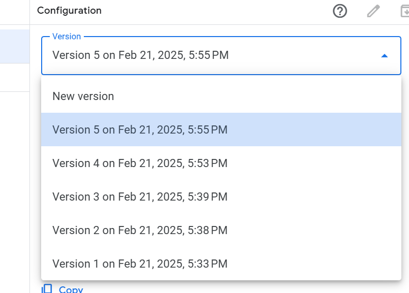

# 零成本构建TG Bot

## 准备工作

1. 一个TG账号
2. 一个Google账号

‍

## 创建方法

1.启动TG，搜索`@BotFather`​开始聊天

2.发送`/newbot`​新建Bot。

3.发送Bot的名字

4.发送Bot的username

5.设置一些属性

6.获取`token`​，直接发送`/token`​即可

7.在[google script](https://script.google.com/home)里

8.新建脚本

9.写如下代码

```javascript
var Bot_Token = "" //换成自己在token

function doPost(e) {
  //讲请求数据的内容不符 转JSON对象
  var body = JSON.parse(e.postData.contents);
  //转为字符型 
  body.message.chat.id = body.message.chat.id + '';
  MsgHandle(body)

}


function MsgHandle(body) {
  var chat_id = body.message.chat.id
  if (body.message.text) { //接收到文本 
    restText = body.message.text;
    if (restText.startsWith("/start")) {
      SendMsg(body.message.chat.id, "你好")
    }
  }
}


function SendMsg(id, text) {

  var payload = {
    "method": "sendMessage",
    "chat_id": id,  // 获取聊天ID
    "text": text, // 消息内容
    "parse_mode": "Markdown"  // 使用Markdown解析模式
  }

  var data = {
    "method": "post",
    "payload": payload
  }
  UrlFetchApp.fetch("https://api.telegram.org/bot" + Bot_Token + "/", data);

}
```

Deploy发布New  deployment，所有人可见

复制web app下的url，结尾带exec的链接

对接TG Bot，访问构造如下链接，并在浏览器访问，看到返回带有ok则成功

```lua
https://api.telegram.org/bot<你的Bot的token>/setWebhook?url=<你的脚本链接>
```

注意讲<你的脚本链接>,<你的Bot的token>都替换成你自己的，前后没有空格

在tg对bot发/start

如果回复了“你好”

就大功告成了

‍

## 更新代码

直接在gs里写完用Manage deployments，点击右上角笔图标，version选择new version，点deploy即可，tg bot那边将会立即更新

​​

## 发送不同类型消息方法

出了上面发送文字消息的函数外，这里还总结了一些其他消息类型发送方法。

```javascript


// 回复消息（会引用目标消息）
function ReplyMsg(chat_id, text, reply_to_message_id) {
  var payload = {
    "method": "sendMessage",
    "chat_id": chat_id,
    "text": text,
    "reply_to_message_id": reply_to_message_id,
    "parse_mode": "Markdown"
  };
  var options = {
    "method": "post",
    "payload": payload
  };
  UrlFetchApp.fetch("https://api.telegram.org/bot" + Bot_Token + "/", options);
}

// 发送图片（photo为图片URL或文件ID，可附带说明文字）
function SendPhoto(chat_id, photo, caption) {
  var payload = {
    "method": "sendPhoto",
    "chat_id": chat_id,
    "photo": photo,
    "caption": caption || ""
  };
  var options = {
    "method": "post",
    "payload": payload
  };
  UrlFetchApp.fetch("https://api.telegram.org/bot" + Bot_Token + "/", options);
}

// 发送视频（video为视频URL或文件ID，可附带说明文字）
function SendVideo(chat_id, video, caption) {
  var payload = {
    "method": "sendVideo",
    "chat_id": chat_id,
    "video": video,
    "caption": caption || ""
  };
  var options = {
    "method": "post",
    "payload": payload
  };
  UrlFetchApp.fetch("https://api.telegram.org/bot" + Bot_Token + "/", options);
}

// 发送表情包/贴纸（sticker为贴纸文件ID）
function SendSticker(chat_id, sticker) {
  var payload = {
    "method": "sendSticker",
    "chat_id": chat_id,
    "sticker": sticker
  };
  var options = {
    "method": "post",
    "payload": payload
  };
  UrlFetchApp.fetch("https://api.telegram.org/bot" + Bot_Token + "/", options);
}

// 发送文件（document为文件URL或文件ID，可附带说明文字）
function SendDocument(chat_id, document, caption) {
  var payload = {
    "method": "sendDocument",
    "chat_id": chat_id,
    "document": document,
    "caption": caption || ""
  };
  var options = {
    "method": "post",
    "payload": payload
  };
  UrlFetchApp.fetch("https://api.telegram.org/bot" + Bot_Token + "/", options);
}

// 发送带按钮的消息（按钮以 inline_keyboard 形式展示）
// buttons 需为二维数组，如：[[{text:"按钮1", callback_data:"data1"}, {text:"按钮2", callback_data:"data2"}]]
function SendMessageWithButtons(chat_id, text, buttons) {
  var reply_markup = {
    "inline_keyboard": buttons
  };
  var payload = {
    "method": "sendMessage",
    "chat_id": chat_id,
    "text": text,
    "reply_markup": JSON.stringify(reply_markup),
    "parse_mode": "Markdown"
  };
  var options = {
    "method": "post",
    "payload": payload
  };
  UrlFetchApp.fetch("https://api.telegram.org/bot" + Bot_Token + "/", options);
}

// 发送投票消息（optionsArray 为选项字符串数组）
function SendPoll(chat_id, question, optionsArray) {
  var payload = {
    "method": "sendPoll",
    "chat_id": chat_id,
    "question": question,
    "options": JSON.stringify(optionsArray)  // API 要求传入 JSON 序列化的数组
  };
  var options = {
    "method": "post",
    "payload": payload
  };
  UrlFetchApp.fetch("https://api.telegram.org/bot" + Bot_Token + "/", options);
}

```

‍

## 接收消息结构

在doPost下我们可以看到`var body = JSON.parse(e.postData.contents);`​

获取了telegram那边的返回的数据解析到body里了

让我们看看body的结构是什么

```json
-----------------群组
{
  "updateid": 636682387,                     // 更新ID，用于唯一标识一次更新
  "message": {                               // 消息对象，包含具体的消息内容
    "messageid": 650,                        // 消息ID，唯一标识该条消息
    "from": {                                // 发送者信息
      "id": 1234567890,                      // 发送者的用户ID
      "isbot": false,                        // 是否为机器人，这里为 false，表示人为发送
      "firstname": "苦小怕",                  // 发送者的名字
      "username": "KuLiPai",                 // 发送者的用户名
      "languagecode": "zh-hans"              // 发送者使用的语言代码（简体中文）
    },
    "chat": {                                // 聊天对象信息
      "id": "-1234567890",                   // 群组的聊天ID，群组ID通常为负数
      "title": "myGroupsss",                 // 群组的名称
      "type": "group",                       // 聊天类型，这里是群组
      "allmembersareadministrators": true    // 是否所有成员都是管理员，这里可能指所有成员都有修改群组的权限
    },
    "date": 1740665459,                      // 消息发送的时间戳
    "text": "/test",                         // 消息文本内容
    "entities": {                            // 消息实体，用于描述文本中特殊部分（如命令）
      "offset": 0,                           // 特殊实体在文本中的起始位置
      "length": 5,                           // 特殊实体的长度
      "type": "bot_command"                  // 实体类型，这里表示是一个机器人命令
    }
  }
}

```

```json
--------------私聊
{
  "updateid": 636682252,                     // 更新ID，用于唯一标识一次更新
  "message": {                               // 消息对象，包含具体的消息内容
    "messageid": 500,                        // 消息ID，唯一标识该条消息
    "from": {                                // 发送者信息
      "id": 1234567890,                      // 发送者的用户ID
      "isbot": false,                        // 是否为机器人，这里为 false，表示人为发送
      "firstname": "苦小怕",                  // 发送者的名字
      "username": "KuLiPai",                 // 发送者的用户名
      "languagecode": "zh-hans"              // 发送者使用的语言代码（简体中文）
    },
    "chat": {                                // 聊天对象信息
      "id": "1234567890",                    // 私聊的聊天ID，通常就是用户的ID
      "firstname": "苦小怕",                  // 聊天对象的名字（私聊时为用户的名字）
      "username": "KuLiPai",                 // 聊天对象的用户名
      "type": "private"                      // 聊天类型，这里是私聊
    },
    "date": 1740130543,                      // 消息发送的时间戳
    "text": "/start",                        // 消息文本内容
    "entities": {                            // 消息实体，用于描述文本中特殊部分（如命令）
      "offset": 0,                           // 特殊实体在文本中的起始位置
      "length": 6,                           // 特殊实体的长度
      "type": "bot_command"                  // 实体类型，这里表示是一个机器人命令
    }
  }
}

```

‍

## 总结

* 不用服务器就可以部署
* 官方Bot永远不会封号(不像某q
* 稳定运行，永远不会掉线(不像某q
* 有官方文档，实现超多功能

‍
